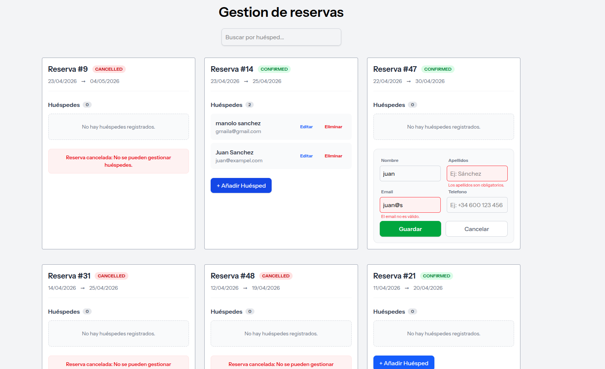

# 🏨 Laravel & Vue Booking Management System


A robust Full Stack application designed to manage property bookings and associated guest data. This project utilizes a **Clean Architecture** approach with **Laravel** for the RESTful API and **Vue 3 (Composition API)** for a reactive, user-friendly frontend.

---

## 📖 Project Context & Methodology

This project was originally developed as a technical challenge under a **strict 3-hour time constraint**. The core CRUD functionality and requirements were delivered within that timeframe.

**Post-Submission Refactoring:**
Following the initial submission, I treated the technical feedback as a rigorous **Code Review** and performed a refactoring phase to simulate a real-world production cycle. This phase focused on performance, UX, and error handling robustness.

### 🚀 Key Improvements (Post-MVP)

| Area | Challenge / Feedback | Solution Implemented |
|------|----------------------|----------------------|
| **Performance** | The search bar triggered API calls on every keystroke. | Implemented **Debouncing/Throttling** strategies to optimize server load and network traffic. |
| **UX / State** | Creating a guest required a page refresh to update the UI. | Leveraged **Pinia's Reactive State** to update the grid instantly upon successful mutation (Optimistic UI). |
| **Stability** | Validation errors caused layout shifts; lack of robust error handling. | Integrated seamless validation UI in **Tailwind**, wrapped critical logic in `try/catch` blocks, and added proper logging. |

---

## 🛠️ Technical Decisions & Architecture

### Backend (Laravel)
*   **Decoupled Validation:** Implemented dedicated **Form Requests** (`StoreGuestRequest`, `UpdateGuestRequest`) to keep Controllers clean and strictly adhere to the Single Responsibility Principle.
*   **Database Integrity:** Designed a `1:N` relationship between `Bookings` and `Guests` using strict foreign key constraints.
*   **Pagination:** API responses are paginated (9 items/page) to ensure scalability.
*   **Testing:** **TDD approach** using **PHPUnit**. Feature tests cover the full CRUD lifecycle of Guests and ensure API structure integrity.

### Frontend (Vue 3 + Pinia)
*   **State Management:** Powered by **Pinia** to handle booking and guest data without unnecessary reloads.
*   **Components:** Modular design using Vue 3 **Composition API** (`<script setup>`).
*   **Styling:** Fully responsive layout built with **Tailwind CSS**.

---

## 📸 Screenshots

 

---

## ⚡ Getting Started

### Prerequisites
*   PHP 8.2+ (with SQLite extension)
*   Composer
*   Node.js + NPM

### Installation

1.  **Clone the repository:**
    ```bash
    git clone https://github.com/JuanjoSG5/laravel-vue-booking-manager.git
    cd laravel-vue-booking-manager
    ```

2.  **Install Backend Dependencies:**
    ```bash
    composer install
    ```

3.  **Install Frontend Dependencies:**
    ```bash
    npm install
    ```

4.  **Environment Setup:**
    ```bash
    cp .env.example .env
    touch database/database.sqlite
    php artisan migrate --seed
    # Or use the provided seeder command:
    # php artisan initialize-bookings
    ```

5.  **Run the Application:**
    ```bash
    composer run dev
    ```
    Access the app at `http://localhost:8000`.

---

## 🧪 Running Tests

To verify the integrity of the application and the new Guest CRUD features:

```bash
php artisan test
```

**Test Coverage Includes:**
*   `GuestTest`: Verifies Create, Read, Update, and Delete flows.
*   `BookingApiTest`: Ensures pagination and data structure correctness.

---

## 📝 Original Challenge Requirements

<details>
<summary>Click to view original task details</summary>

### Objectives
*   Implement a new feature to manage **guest data associated with bookings**.
*   Expose data through the API and manage it via the UI.
*   **Stack:** Laravel, Vue, Tailwind, Pinia.

### Tasks Implemented
1.  **Guest Data Model:** Created migrations, models, and relationships.
2.  **Display Bookings:** Grid layout using Pinia and Tailwind.
3.  **Guest Functionality:** Full CRUD accessible within each booking card.
4.  **Extra Improvements:** 
    *   Dynamic Search (with debounce).
    *   Pagination.
    *   UI/UX Refinements.

</details>